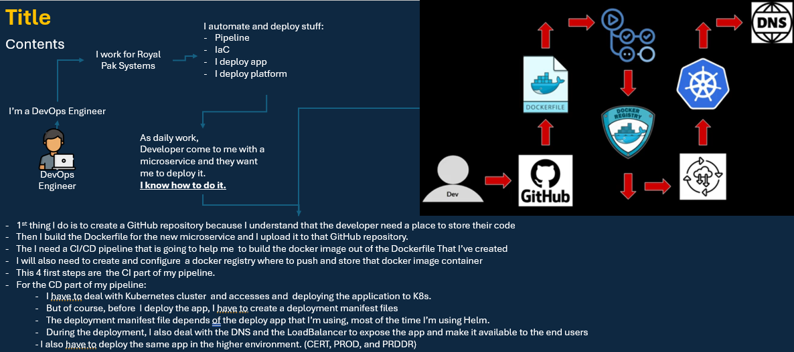
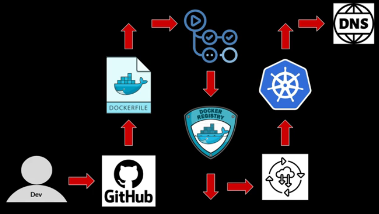

# a01_Platform_Engineering_Backstage
Platform Engineering, Backstage, Kubernetes, ArgoCD, Docker, GitOps, Helm, GitHub Actions &amp; CI/CD to build IDPs

## Goal:
- Deep understanding of Platform Engineering and Internal Developer Portals (IDPs)
- Automate DevOps workflows using Backstage and Platform Engineering best practices
- Build, containerize, and deploy real-world applications from scratch
- Create a fully functional Internal Developer Platform (IDP) with Backstage
- Write and manage Documentation as Code using Backstage TechDocs
- Develop custom Backstage Software Templates to standardize application deployment

## Description
- This project requires me to download docker from the official Docker Repositories as well as images from Docker Hub. 
- As a DevOps engineer looking to take your career to the next level, here is how Platform Engineering and Internal Developer Portals (IDPs) can revolutionize the way teams develop, deploy, and manage applications
- This project take me from DevOps to Platform Engineering by mastering Backstage, an open-source framework developed by Spotify, and integrating it with modern DevOps tools to build a fully functional Internal Developer Platform (IDP).
- In this hands-on, project-based, I will work on real-world DevOps projects, implementing automation and self-service workflows to streamline software delivery. By the end of this project, I will gained practical experience in:
    - Building and deploying applications using Docker, Kubernetes, and ArgoCD
    - Automating CI/CD pipelines with GitHub Actions
    - Creating an Internal Developer Platform (IDP) using Backstage
    - Writing Documentation as Code with Backstage TechDocs
    - Implementing Software Templates for faster application deployments
    - Deploying Backstage in a production environment

- This project is practical, hands-on, and friendly. Understanding of DevOps, CI/CD, and infrastructure management is a prior.

## Who also can foolow me in this project:
- DevOps Engineers looking to transition into Platform Engineering
- Cloud Engineers interested in self-service platforms and developer enablement
- Software & Infrastructure Engineers with a DevOps background who want to master Internal Developer Platforms (IDPs)

## Global Picture DevOps daily tasks 

- Platform engineer is build on top of DevOps
    - DevOps bridges the gap between Dev and Ops to speed up software delivery. (Developers and Operations work together)
    - Platform emgineer use fundation of DevOps to speed up software delivery in a certain way, which is by crearting specialized platforms. (Provide the infrastructure that support the collaboration between Developers and Operations.)
    - **Platform Engineer (https://en.wikipedia.org/wiki/Platform_engineering)** is:
        - Platform engineering is a software engineering discipline focused on the development of self-service toolchains, services, and processes to create an internal developer platform (IDP). The shared IDP can be utilized by software development teams, enabling them to innovate.
        - Platform engineering uses components like configuration management, infrastructure orchestration, and role-based access control to improve reliability. The discipline is associated with DevOps and platform as a service practices.

## Internal Developer Platform (IDP)
- IDP is the tool that bring platform Engineering to life
    - its a self service platform that gives developers everything they need to build, deploy and manage their applications.
- I can create IDP from scratch
- Or I can use open source IDP such as Backstage
    
## Backstage
- URL: https://backstage.io/docs/overview/what-is-backstage
- Backstage is an IDP
- Bckstage is an open source framework for building developer portals. 
Powered by a centralized software catalog, Backstage restores order to your microservices 
and infrastructure and enables your product teams to ship high-quality code quickly — without compromising autonomy.
- Backstage Developed and made open source by Spotify
- Backstage was accepted by the CNCF in 2020

## DevOps:
- Creating **APIs**
- Creating **CI/CD pipelines**
- Run those APIs on **Docker**
- Run Docker container on **Kubernetes**
- Deplying using **Helm**
- Deploying using **ArgoCD**
- Deploying everything through our CI/CD pipeline powered by **GitHub Actions**

## Backstage:
- Backstage Deployment
- The software Catalog
- Backstage TechDocs
- Software Templates
- Production Mode (How to deploy Backstage in production mode)
- Kubernetes Deployment

## DevOps Skills
- Get the Python Application from Dev
- Create a Dockerfile
- Build it
- Push the artifact (Docker container) to the GitHub repository
- Build the pipeline that does all those build steps for me
- Deploy the app to K8s using Helm
- Also using ArgoCD to help the app deploy

## Scenario use to develop our app
- I'm a DevOps Engineer working for an organization
- some developer in our organization want to deploy a Python application
- I'm responsible deploy by my own that application on K8s

## My Plan is to split thos tasks by creating microservices using the best DevOps practices
- 1st, I'm creating the GitHub repository because I want to give to developer the power of share and versioning their code
- 2nd, I'm going to write a basic application, a very basic API using Python so that my developer can start from there. Most of the time, I get the code from my developers.
- Then I going to containerize the app by writing the Dockerfile, building the docker container and pushing it to the docker registry.
- After that I'm going to create a CI pipeline that does all previous steps for me. So every time any developer changes the code, a new container will be built and pushed to the container registry

- **Once the build and push is completed, I'm going to deploy the container on Kubernetes.**
- I'm going to be using to deploy:
    - K8s files using kubectl
    - Helm chatrs
    - and ArgoCD
- Soon as I feel comfortable with the deployment, I automate the entire CI/CD of that application through a continuous CI/CD pipeline using GitHub actions

